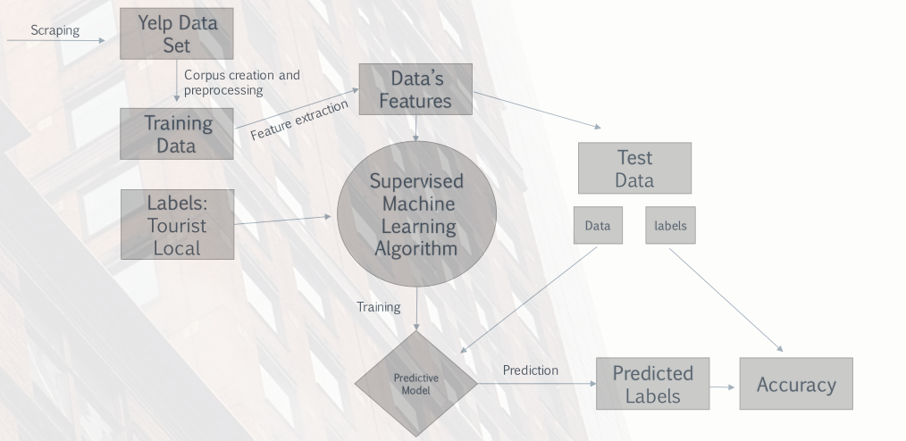
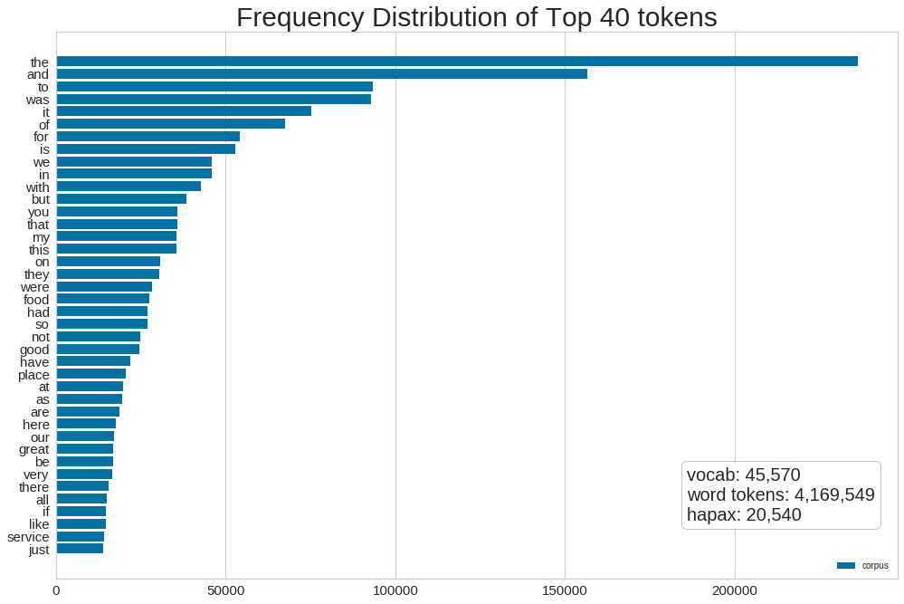
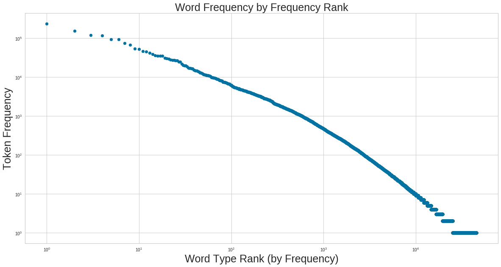
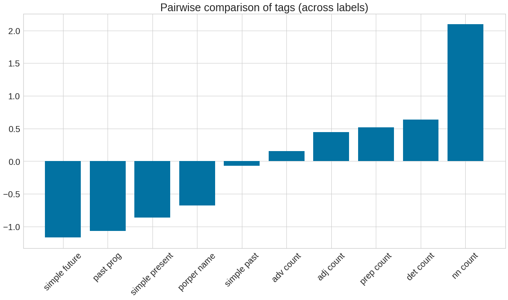
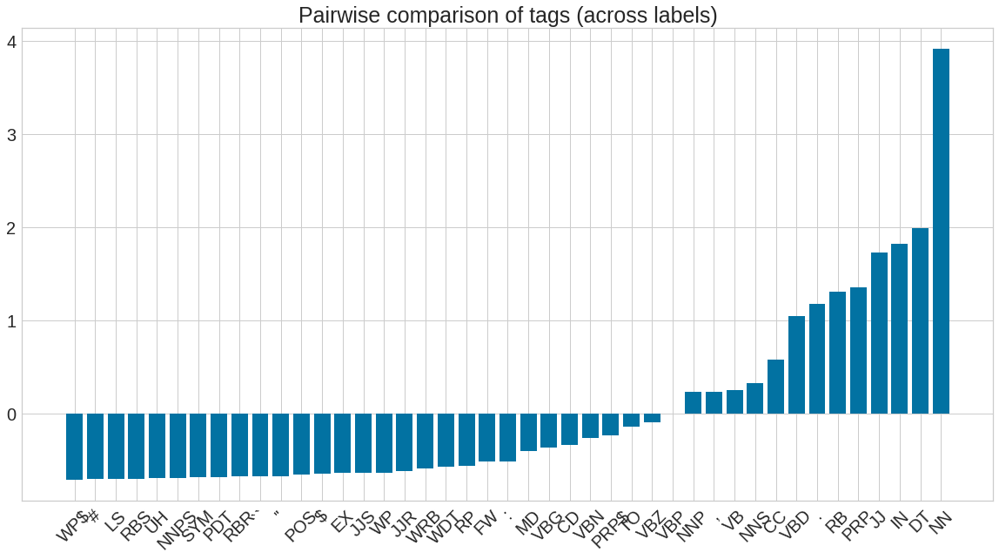
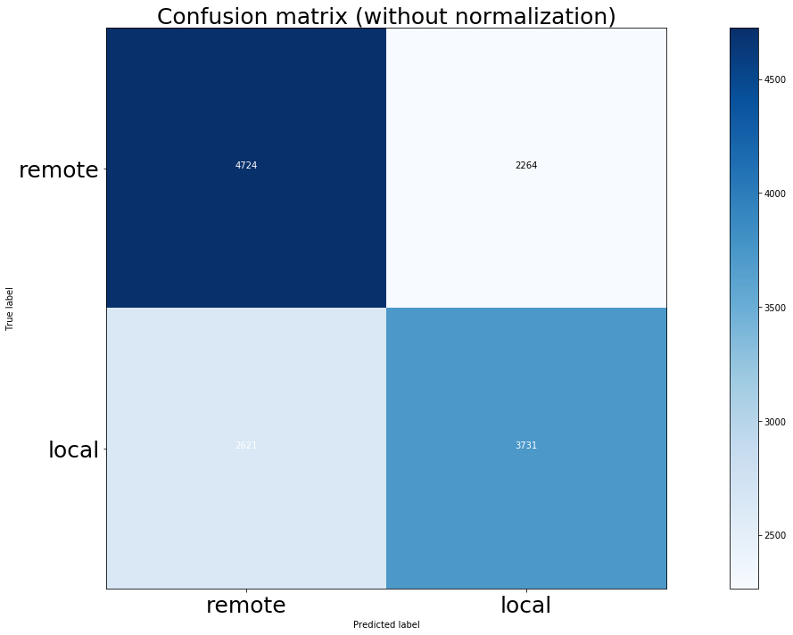
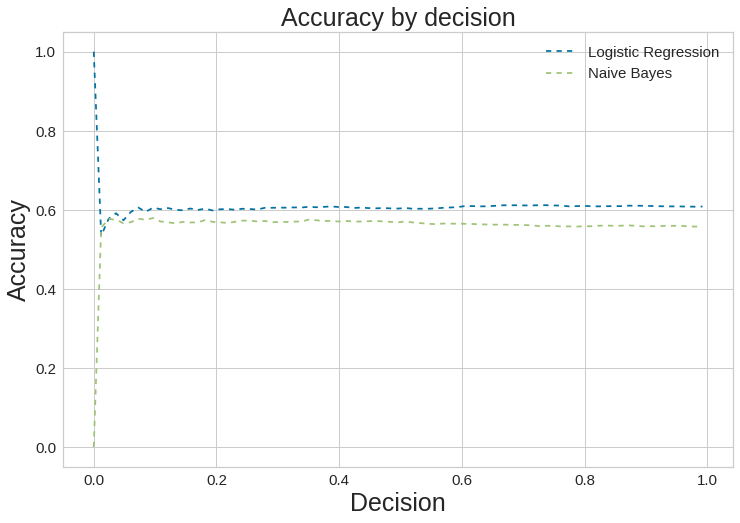

## Hypothesis

Everyday millions of restaurant goers record their experiences and express their opinion on the web. Due to the enormous amount of money spent on tourism in the United States, identifying these tourist and their preferences is a worthy endeavor. So, my project started with the hypothesis that tourist to a region generally have different expectations, preferences , and satisfaction thresholds than a local from the same region. This should be reflective is the speech behavior and utterance patters of internet users. Therefore, using Yelp as a corpus to for sentiment analysis and opinion mining, I set out to confirm that there are inherent linguistic differences in reviews of tourists and locals that allow for traditional machine learning classifiers to accurately predict whether a review was written by a tourist. The workflow for this project is represented in the following workflow:

## The Data: Gathering the Corpus

I decided to restrict my research to reviews of restaurants written in English by tourists in the United States. However, similar techniques could be applied to other languages and domains. To this goal, I decided to code a web [crawler](https://github.com/tybrs/yelp-corpus-generator) to scrap reviews from five of the most visited and highly populated areas to harvest reviews for my corpus:

    * New York, NY
    * Chicago, IL
    * Las Vegas, NV
    * Los Angeles, CA
    * Orlando, FL

This allows for the equal sampling of local and tourist reviews from a multitude of cities. The final results included 53,000 reviews across 42,800 URLs. In order not to over represent cities with more reviews I took a sample of 6,859 reviews from each area. While scraping I was able to populate the data with labels for training and testing, by comparing the user's location against the business the review is about.

## Corpus Analysis

First I analyzed the distribution of word frequencies. The graph below shows the top forty most common words from the corpus as well as the size of the vocabulary (amount of unique words), and hapax lenomegon (amount of unique words with a frequency of one):

Then I checked that the distribution followed Zipf’s law which states the frequency of any word type in natural language corpora of utterances is inversely proportional to its rank in the frequency table. So, we can easily check Zipf's Law on the corpus of Yelp reviews by plotting the frequencies of the word types in rank order on a log-log graph.

I used the [Stanford Log-linear Part-Of-Speech Tagger](https://nlp.stanford.edu/software/tagger.shtml), a Java implementation of the log-linear maximum entropy part-of-speech taggers described in Toutanova et al. (2003), as a POS-tagger for the corpus.

This allowed me to do a pairwise POS-tag analysis on the corpus to find possible indicators for classification implemented from Pak & Paroubek (2010):

where  and  denote then number of tag T occurrences in local and remote reviews respectively. The following graph represents the  values for local vs. remote reviews:

{
  width: 70%;
  border: none;
  background: none;
}
{
  width: 70%;
  border: none;
  background: none;
}

The Standford POS-tagger uses the Penn Treebank tag set. To better interpret a tag’s abbreviation, descriptions can be found [here](https://www.ling.upenn.edu/courses/Fall_2003/ling001/penn_treebank_pos.html)).

You can see that verbs in the singular present (VBZ, VBP) are more common in local reviews. While verbs in the simple past are more common in remote reviews. This is consistent with the intuition that locals are in a  more salient position to speak in the present or the future than tourists. Also the graph shows that adverbs (RBS) are more indicative of local speech. Adverbs can be used to express information about the time, manner, degree, place, frequency of an state or event. Many of these adverbs of time presuppose reoccurrence (e.g. ‘never’, ‘lately’, ‘often’, recently, ‘Tuesday’, ‘today’, ‘yet’, ‘soon’, ‘always’, etc.). So one conjecture can be made that people whose assumed audience are locals are more likely to speak with adverbs of this variety. This intuition will also be later confirmed once I introduce the notion of salience, which measures how likely a n-gram is to be in one category over its alternative category.

## Predictive Modeling

For features, I constructed an n-gram model of the corpus that included both unigrams and bigram with a combined vocabulary of 434,103 n-grams. In order to increase accuracy and decrease noise I implemented Pak & Paroubek’s (2010) strategy of calculating salience to discriminate common n-grams. Salience is calculated as follows:

The following tables include some n-grams with a high salience:

| UNI-GRAM​ | SALIENCE​ | LABEL​  |
|----------|----------|--------|
| disney​   | 0.883721​ | remote​ |
| hotel​    | 0.812500​ | remote​ |
| nyc​      | 0.810526​ | remote​ |

I used a salience threshold to filter out common n-grams. Then, I built a classifier that used a n-gram model after and the distribution of POS frequencies to estimate whether a review was written by a tourist or a local. The final classifier was tested against a confusion matrix and produced the following confusion matrix normalized across true labels.

